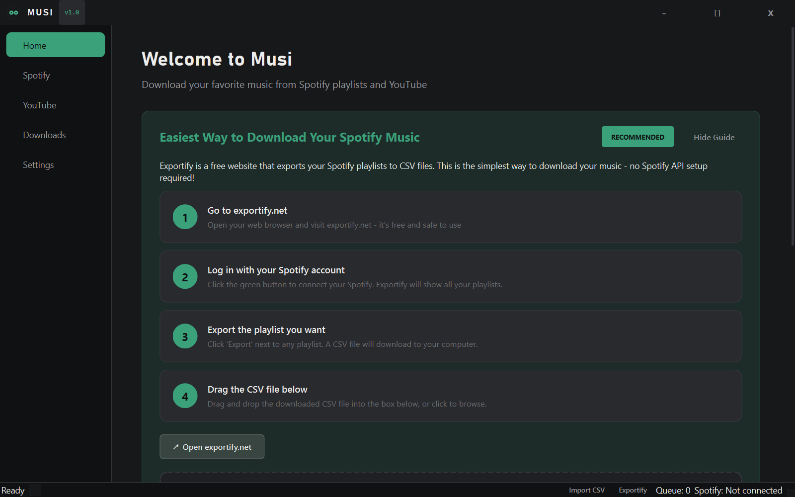
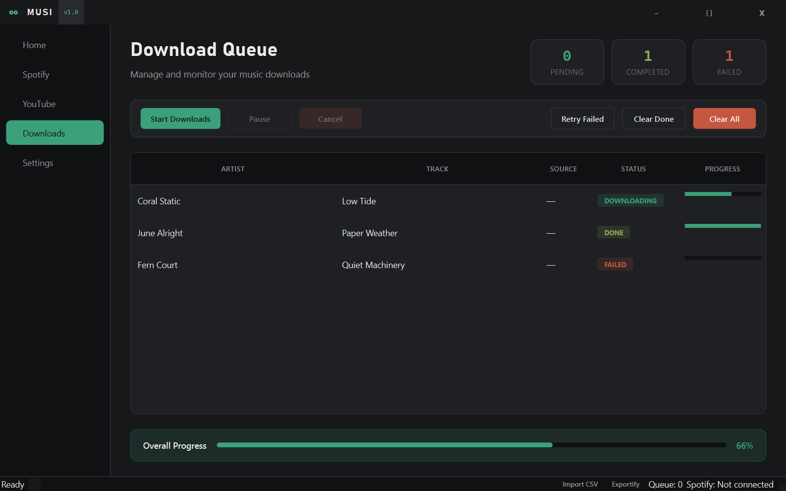
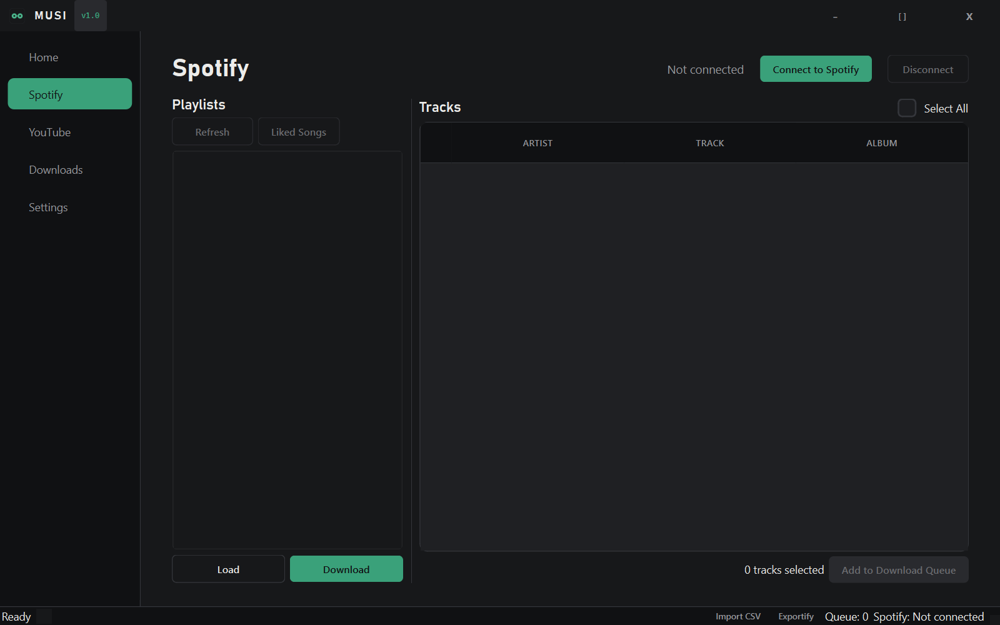
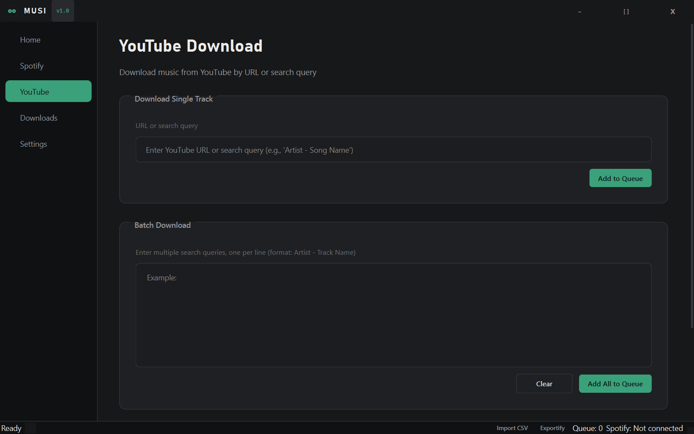
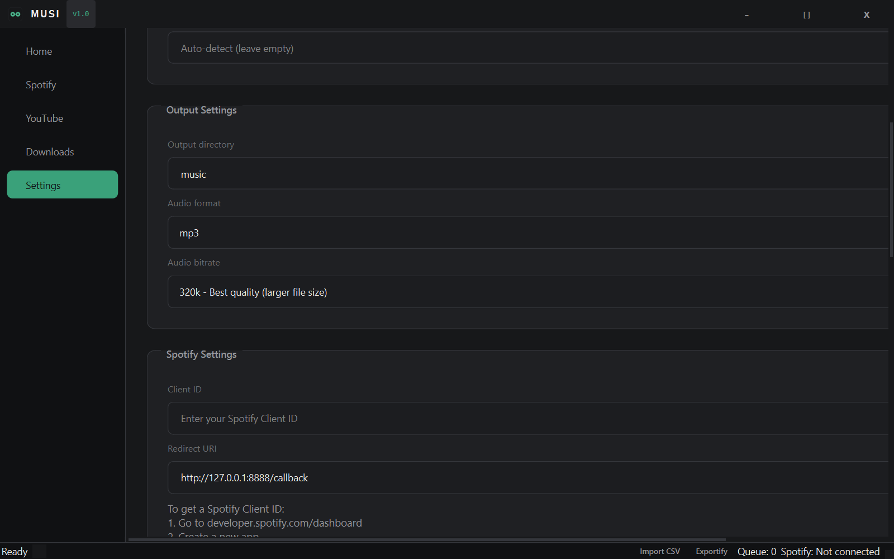

<p align="center">
  
</p>

<h1 align="center">Chaos Media Downloader</h1>

<p align="center">
A Python tool for downloading music from Spotify and YouTube, or video from hundreds of other sites, using <strong>yt-dlp</strong>.<br>
Available as a standalone executable, desktop GUI application, or command-line interface.
</p>

Chaos Media Downloader (formerly Musi) is a fork of [Harmoni](https://github.com/Ssenseii/harmoni) by [Ssenseii](https://github.com/Ssenseii), redesigned with a dark "Tape Deck" interface (charcoal-black with a green accent, replacing the original purple theme) and extended with new features. All credit for the original project goes to its author — see [LICENSE](LICENSE) for the MIT terms this fork keeps.

## What's different from Harmoni

- **Redesigned GUI and logo** — a charcoal-black "Tape Deck" theme with a green accent, condensed display type, chip-style status badges in the download queue, and a new twin-reel logo, replacing the original dark-purple interface.
- **320kbps downloads** — a new `audio_bitrate` setting (default `320k`) controls download quality, editable from Settings or the CLI's "Choose audio bitrate" tool.
- **Convert your library with ffmpeg** — convert already-downloaded files to a different format/bitrate in bulk, from Settings → Library Maintenance or the CLI's "Convert audio format" tool.
- **Download history & duplicate protection** — every download is logged to `data/download_history.json` by canonical artist/track, independent of the file. If a track was downloaded before but is no longer in your library, you're asked before re-downloading it instead of silently redoing the work.
- **Auto-redownload corrupted files** — library cleanup no longer just deletes broken/empty audio files; it automatically re-queues a redownload for each one (toggle via `auto_redownload_corrupted`).
- **Auto-fetched lyrics** — plain lyrics are pulled from [lrclib.net](https://lrclib.net) (no API key needed) and embedded alongside the rest of the track's metadata, toggle via `enable_lyrics_fetch`.
- **In-app update checker** — checks GitHub Releases in the background on launch and prompts to open the download page if a newer version is out.
- **Favorites** — save a link or search under a name for one-click re-download later, without re-typing or re-navigating.
- **Video downloads** — download the actual video (not just audio) from YouTube, TikTok, Instagram, Twitter/X, Reddit, Twitch, and hundreds of other yt-dlp-supported sites, kept separate from the music library.

See [changelog.md](changelog.md) for the full history inherited from Harmoni.

## Screenshots

| Home | Downloads |
|------|-----------|
|  |  |

| Spotify | YouTube |
|---------|---------|
|  |  |

| Settings |
|----------|
|  |

## Features

- **Desktop GUI** - Modern graphical interface with drag-and-drop Exportify support
- **Spotify Integration** - Download from your playlists and liked songs via OAuth
- **YouTube Downloads** - Download from links or search by artist/song
- **Batch Downloads** - Download entire playlists with concurrent processing, at up to 320kbps
- **Exportify Support** - Import playlists from CSV exports (easiest method!)
- **Metadata Embedding** - Automatic ID3 tagging, including auto-fetched lyrics
- **Library Management** - Duplicate detection (even for deleted files), corrupted-file cleanup with auto-redownload, format conversion, and organization
- **Video Downloads** - Full video (not just audio) from YouTube and hundreds of other sites
- **Favorites** - Save links/searches for one-click re-download

## Installation Options

### Option 1: Standalone Executable (Easiest)

Download from the [Releases](https://github.com/HijasT/ChaosMD/releases) page:

- **Windows**: `ChaosMD.exe` — double-click to run
- **macOS**: `ChaosMD-macos-arm64.dmg` (Apple Silicon) — open the DMG and drag ChaosMD to Applications

No Python installation required. FFmpeg is bundled.

See [Standalone Guide](docs/guides/standalone.md) for details.

### Option 2: Python Installation

```bash
# Clone and install
git clone https://github.com/HijasT/ChaosMD.git
cd ChaosMD
pip install -r requirements.txt

# Run the GUI
python gui_main.py

# Or run the CLI
python main.py
```

### Option 3: Docker

```bash
docker compose build
docker compose run --rm --service-ports harmoni
```

### Option 4: Build macOS from Source

On any Mac with Python 3.12+ and Homebrew:

```bash
chmod +x build-macos.sh
./build-macos.sh
```

This produces a `ChaosMD-macos-<arch>.dmg` with ffmpeg bundled.

## Quick Start

### GUI (Recommended)

The easiest way to download your Spotify music:

1. Launch Chaos Media Downloader (exe, app, or `python gui_main.py`)
2. Go to [exportify.net](https://exportify.net) and log in with Spotify
3. Export your playlists as CSV files
4. Drag and drop the CSV into the app

No Spotify API setup required!

### Command Line

```bash
python main.py
# or
./start.sh
```

See [CLI Guide](docs/guides/cli.md) for all available commands.

## Requirements

- **Standalone EXE/DMG**: None (ffmpeg bundled)
- **Python version**: Python 3.9+ and ffmpeg

## Documentation

See the [docs/](docs/) folder for detailed guides:

- [Installation Guide](docs/guides/installation.md) - Full setup instructions
- [GUI Guide](docs/guides/gui.md) - Using the desktop application
- [CLI Guide](docs/guides/cli.md) - Command-line interface reference
- [Standalone Guide](docs/guides/standalone.md) - Using the executable
- [Spotify Setup](docs/guides/spotify-setup.md) - Connect your Spotify account
- [Configuration](docs/guides/configuration.md) - Settings reference
- [Docker](docs/guides/docker.md) - Container deployment

## License

MIT License - see [LICENSE](LICENSE) for details. Original work Copyright (c) 2025 Ssenseii.

## Disclaimer

This tool is for **personal use only**. Respect copyright laws and platform terms of service.
